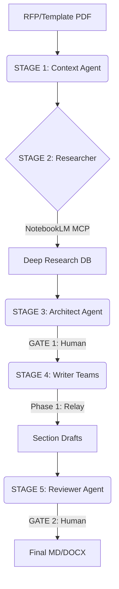

# 🛡️ R&D Proposal Harness: The War Against the Paper Monster
### Next-Gen R&D Proposal Automation with NotebookLM MCP & Multi-Agent Orchestration

[](https://opensource.org/licenses/MIT)
[](https://www.python.org/downloads/release/python-390/)
[](#)

> **"Rescue the souls of scientists from the suffocating fog of administrative bureaucracy."**
> **"과학자들의 영혼을 지독한 행정 만능주의의 안개로부터 구출하라."**

---

## ▣ Vision: The Intellectual Liberation
Research should be about microscopes and accelerators, not endless forms and spreadsheets. This harness is not just a tool; it's a **"First Step"** toward a revolution where AI partners with humans to handle the crushing weight of administrative tasks, allowing researchers to focus on what truly matters: **Exploration.**

연구는 서류 뭉치가 아니라 현미경과 가속기 앞에서 이루어져야 합니다. 본 하네스 시스템은 행정의 무게를 AI가 분담하고, 연구자는 오직 탐구에만 집중할 수 있는 시대를 여는 **'지적 해방'의 첫걸음**입니다.

---

## ▣ Key Features (Hybrid Version)

### 1. 🧠 NotebookLM Deep Research Protocol (MCP)
- **Automatic Ingestion**: Ingests Market Stats, Tech Trends, Academic Papers, and Policy Reports via NotebookLM MCP.
- **Deep Context**: Leverages Gemini's 2M token window to maintain deep logical consistency across a 60-100 page proposal.
- **Visual Proof**: Automatic browser recording (WebP) of the research process to ensure data integrity and transparency.

### 2. 🏻 AX v2.0 Administrative Rigor
- **Multi-Agent Orchestration**: Sequential context relay between specialized agent teams (Context, Researcher, Architect, Writer, Reviewer).
- **Itemized Writing Standard**: Enforces the strict "Ga-jo-sik" (개조식) writing style required by government agencies.
- **Sentinel Monitoring**: Real-time monitoring of agent states, token usage, and administrative constraints.

### 3. 🎨 Visualization Engine
- **Mermaid Integration**: Minimum 12+ diagrams (Architecture, Flowcharts, Gantt) per proposal.
- **DALL-E 3 / Imagen Prompting**: Automated high-fidelity image prompt generation for technical infographics.

---

## ▣ System Architecture



---

## ▣ Quick Start

### 1. Requirements
- Python 3.9+
- Antigravity / Claude Code Environment
- Google NotebookLM MCP Server

### 2. Installation
```bash
git clone https://github.com/ohgyeongdon/RnD-Proposal-Harness-NotebookLM-Hybrid.git
cd RnD-Proposal-Harness-NotebookLM-Hybrid
pip install -r requirements.txt
```

### 3. Setup
Edit .env file:
```env
SETUP_MODE=MANUAL # recommended for first run
ANTIGRAVITY_TOKEN=your_token_here
```

---

## ▣ Philosophy: An Evolving Prototype
This system is not a "finished product." It is a **living prototype**, a record of our first step toward automation. It is designed to be refined, hacked, and evolved by the community. We don't aim for perfection; we aim for **possibility.**

이 시스템은 완성된 결과물이 아닙니다. 자동화를 향한 우리의 첫걸음을 기록한 **'진화하는 프로토타입'**입니다. 우리는 완벽함이 아니라, **가능성**을 향해 나아갑니다.

---

## ▣ License
Distributed under the MIT License. See LICENSE for more information.

---

## ▣ Author
**Yeopjul (엽줄)** - *Visionary of R&D Automation*
- Blog: https://yeopjul.tistory.com
- Project: [War Against the Paper Monster Series]

---
*"The automation node is the key to an era where humans can focus on being most human."*